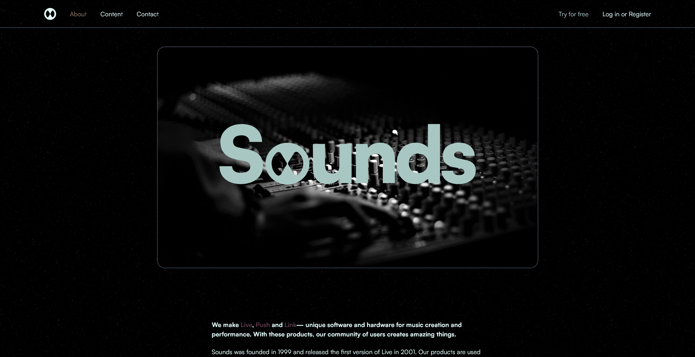

### Introduction

Welcome to the documentation for the sounds landing page web. This document aims to provide developers with a comprehensive guide on how to understand, contribute to, and extend the functionality of sounds landing page.

**Note: This project isn't from real company it's for my portofolio display**

### Web Screenshot


### Technologies Used

Sounds landing page is built using the following technologies:

- **React**: A JavaScript library for building user interfaces.
- **TypeScript**: A typed superset of JavaScript that compiles to plain JavaScript.
- **Tailwind**: A utility-first CSS framework for rapidly building modern websites without ever leaving your HTML.

### Prerequisites

Before you begin working with this project, ensure that you have the following prerequisites installed on your machine:

- **Node.js**: Make sure you have Node.js installed. You can download it from [https://nodejs.org/](https://nodejs.org/).
- **npm or yarn**: npm comes bundled with Node.js installation. Alternatively, you can use yarn as a package manager. Install yarn globally by running `npm install -g yarn`.

### Setting Up the Development Environment

1. Clone Sounds repository from GitHub:

   ```bash
   git clone https://github.com/prmditya/sounds.git
   ```

2. Navigate to the project directory:

   ```bash
   cd sounds
   ```

3. Install dependencies using npm or yarn:

   ```bash
   npm install
   # or
   yarn install
   ```

### Running the Application Locally

To run the project locally on your machine, follow these steps:

1. Start the development server:

   ```bash
   npm run dev
   # or
   yarn dev
   ```

### Understanding the Codebase

The codebase of sounds landing page is organized as follows:

- **src**: Contains the source code of the application.
  - **components**: Contains React components used throughout the application.
    - **ui**: Contains small ui like input box.
  - **App.tsx**: The main entry point of the application.

### Contributing

We welcome contributions from the community. If you'd like to contribute to this landing page, please follow these guidelines:

1. Fork the repository on GitHub.
2. Create a new branch for your feature or bug fix.
3. Make your changes and ensure all tests pass.
4. Submit a pull request with a clear description of your changes.
